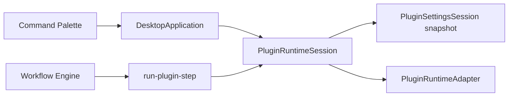

# M57-M58 Plugin Runtime Host Commands and Workflow Adapter

Version: 1.0 | Status: Complete | Date: 2026-07-06

## Scope

M57/M58 implement the first safe Plugin Runtime execution path from `RFC-0001`:

- M57 exposes valid plugin host-command contributions through the Application command registry and executes them through an injected runtime adapter.
- M58 adds workflow plugin-step parsing, `run-plugin-step` next actions, and Application-level workflow-step adapter execution.

## Design Reason

`PROJECT_CONSTITUTION.md` P6 requires plugin extensibility, while P8 and section 10 require strict boundaries and least privilege. The selected slice gives users visible plugin contributions and workflow integration without letting third-party code touch project files, Electron, LLM adapters, or the renderer.

## Data Flow



## Module Relationship

- `packages/application`: owns `PluginRuntimeSession`, policy checks, command listing, command execution, and workflow-step adapter calls.
- `packages/workflow-engine`: parses plugin steps and emits deterministic `run-plugin-step` actions.
- `packages/plugin-engine`: remains the manifest/capability policy foundation.
- `packages/ui` and Electron renderer: continue using Application APIs; no direct filesystem or plugin execution access.

## Advantages

- Keeps runtime execution mockable and deterministic.
- Makes plugin commands discoverable in the command layer.
- Adds workflow-step support without making Workflow Engine impure.

## Limitations

- No arbitrary plugin package execution.
- No marketplace, install, update, signing, or sandboxed-code mode.
- Disabled reasons are available in command metadata, but richer UI treatment remains future work.

## Future Extension

- Sandboxed plugin workers with cancellation, timeout teardown, signing, and permission prompts.
- Contribution input/output schema registry.
- Workflow-run history records for redacted plugin step inputs and outputs.
- UI affordances for disabled plugin contribution reasons.

## Risk Analysis

| Risk                                       | Impact                    | Handling                                                                            |
| ------------------------------------------ | ------------------------- | ----------------------------------------------------------------------------------- |
| Plugin permissions drift from manifest     | Runtime overexposure      | Listing and execution both validate capability, contribution, permission, and scope |
| Workflow plugin execution becomes implicit | Debugging and replay risk | Workflow Engine emits only a structured action                                      |
| Adapter output is malformed                | Workflow state corruption | Runtime rejects non-record output                                                   |

## Directory Structure

```text
packages/application/src/plugin-runtime-session.ts
packages/application/test/plugin-runtime-session.test.ts
packages/workflow-engine/src/workflow-engine.ts
packages/workflow-engine/test/workflow-engine.test.ts
```

## Changelog

- v1.0: Initial M57/M58 productization record.
