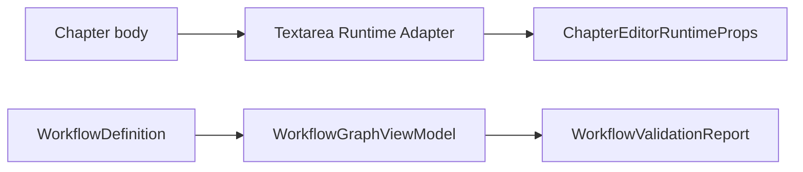

# M59-M60 Editor Runtime Adapter and Workflow Graph Projection

Version: 1.0 | Status: Complete | Date: 2026-07-06

## Scope

M59 extracts the textarea editor runtime into a renderer adapter. M60 adds Workflow Engine graph projection and validator APIs for future Workflow Designer work.

## Design Reason

`RFC-0002` requires adapter-first editor migration so CodeMirror can be introduced later without breaking autosave, recovery, version history, and AI diff review. `RFC-0003` requires workflow graph editing to remain a projection of canonical JSON, not a new execution layer.

## Completed Capabilities

- Textarea runtime adapter with structured events and runtime snapshot.
- Runtime props derived outside `App.tsx`, preserving current `ChapterEditor` behavior.
- Workflow graph projection with nodes and next/branch/default edges.
- Workflow validation report for structural graph issues.

## Data Flow

## Non-Goals

- CodeMirror 6 is not enabled.
- Selection-aware AI commands are not enabled.
- Workflow graph UI is not enabled.
- Graph layout is not persisted.
- Workflow execution is not changed.

## Future Extension

- Add CodeMirror adapter behind a feature flag.
- Add editor selection metadata to AI workflow commands.
- Add Workflow Studio read-only graph UI.
- Add Application-level validator inputs for Agent/Plugin availability.

## Risks

| Risk                                             | Impact                            | Handling                                               |
| ------------------------------------------------ | --------------------------------- | ------------------------------------------------------ |
| Runtime adapter diverges from editor UI          | Inconsistent status               | Runtime props stay derived from adapter snapshot tests |
| Graph validator lacks Application context        | Some availability checks deferred | M60 validator covers structural rules only             |
| Graph projection is mistaken for source of truth | Persistence drift                 | Product docs state only workflow JSON is persisted     |

## Changelog

- v1.0: Initial M59/M60 productization record.
