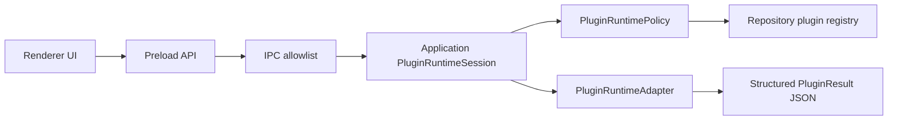

# RFC-0001 Plugin Runtime

Version: 1.0 | Status: Accepted for M54 | Date: 2026-07-06

## Summary

M54 defines the Plugin Runtime boundary for Novel Studio. The runtime must let project-installed plugins contribute commands, asset views, and workflow steps without violating local-first storage, least privilege, or deterministic workflow execution.

The accepted direction is a staged runtime:

1. Validate and register plugin manifests through the existing plugin registry.
2. Expose plugin contributions as structured capabilities in Application/UI.
3. Execute only host-mediated plugin actions through a `Plugin Runtime Adapter`.
4. Keep arbitrary third-party code execution out of v1 until sandbox policy, signing, and permission prompts are implemented and tested.

This RFC resolves TD-027 at the design level, not at the full implementation level.

## Motivation

The constitution requires plugins from day one (P6, section 10), but plugins are also an untrusted boundary. M18 established manifests, registry settings, permissions, and compatibility checks. M42 exposed plugin management in Settings. The missing product-level design is how enabled plugins become usable without giving them unrestricted filesystem, network, model, or Electron access.

## Decision

Plugin Runtime is an Application-level orchestration boundary backed by explicit adapters:

- `PluginRegistryRepository`: reads project plugin registry and local manifests.
- `PluginRuntimePolicy`: validates enabled state, app compatibility, capability, permission grant, and scope.
- `PluginRuntimeAdapter`: executes approved runtime actions. In v1 this adapter is host-owned and fixture-backed by default.
- `PluginRuntimeSession`: exposes safe commands, asset views, and workflow step descriptors to the Application layer.

Plugins must never call Repository, LLM Adapter, Workflow Engine, Electron, or filesystem APIs directly. They receive structured input DTOs and return structured output DTOs.

## Runtime Modes

| Mode             | Purpose                                                                     | v1 Status                            |
| ---------------- | --------------------------------------------------------------------------- | ------------------------------------ |
| `manifest-only`  | Show plugin metadata, capability, permissions, and compatibility            | Already available                    |
| `host-command`   | Execute host-provided commands declared by a plugin manifest                | Accepted for first runtime slice     |
| `workflow-step`  | Let Workflow Engine request a plugin step through Application orchestration | Accepted with mock/fixture execution |
| `sandboxed-code` | Execute third-party plugin code in an isolated runtime                      | Deferred                             |
| `marketplace`    | Discover, install, update, and verify remote plugins                        | Deferred                             |

## Data Flow



The renderer never reads plugin files or invokes plugin code. Workflow execution calls Plugin Runtime only through Application orchestration after Workflow Engine returns a structured action.

## Permission Model

Permissions stay capability-specific and scope-bound:

- `project:read`: read project summary DTO only.
- `asset:read`: read declared asset scopes.
- `asset:write`: write declared asset scopes only after explicit user confirmation.
- `workflow:invoke`: allow workflow engine orchestration to call declared plugin workflow step.
- `network:access`: deferred and denied by default.
- `model:invoke`: deferred; plugins may request an Application-owned AI workflow, not direct LLM Adapter access.

Permission grants are project-local in `plugins/plugins.json`. Secrets are not stored in plugin manifests or registry settings.

## Workflow Integration

Workflow definitions may reference plugin steps by stable contribution id:

```json
{
  "id": "plugin_map_step",
  "type": "plugin",
  "pluginId": "example.map-tools",
  "contributionId": "generate-map-outline",
  "inputSchemaRef": "plugin://example.map-tools/schemas/map-outline-input"
}
```

Workflow Engine remains deterministic and does not execute plugins. It returns a `run-plugin-step` action. Application validates policy, calls the adapter, then completes the workflow step with structured output.

## Security Requirements

- Disabled, incompatible, invalid, or ungranted plugins cannot register commands or workflow steps.
- Plugin runtime errors must use unified stable codes and redact secrets/user manuscript content by default.
- Plugin execution must be cancelable and timeout-bound.
- Network and filesystem access are denied unless a future RFC adds a sandboxed permission model.
- Any future sandboxed-code mode requires separate ADR/RFC covering isolation, signing, update provenance, and teardown.

## Error Codes

- `PLUGIN_RUNTIME_UNAVAILABLE`
- `PLUGIN_RUNTIME_PERMISSION_DENIED`
- `PLUGIN_RUNTIME_TIMEOUT`
- `PLUGIN_RUNTIME_INVALID_INPUT`
- `PLUGIN_RUNTIME_INVALID_OUTPUT`
- `PLUGIN_RUNTIME_ADAPTER_FAILED`
- `PLUGIN_RUNTIME_UNSUPPORTED_MODE`

## Testing Requirements

- Policy tests for disabled, incompatible, missing capability, and missing permission.
- Adapter fixture tests for command and workflow-step execution.
- IPC/preload allowlist tests before any renderer-visible command is exposed.
- Workflow integration tests with mock plugin step output.
- Secret redaction tests for plugin errors.
- Package boundary tests proving plugin runtime does not depend on UI/Electron/Repository internals except through declared ports.

## Non-Goals

- Remote marketplace.
- Automatic plugin update.
- Running arbitrary npm packages or Python scripts.
- Plugin webview/iframe UI sandbox.
- Direct plugin access to project files, secrets, network, model adapters, or Electron APIs.

## Rollout Plan

1. M57: Add `PluginRuntimeSession`, runtime policy tests, and host-command fixtures.
2. M58: Expose plugin command contributions in Command Palette with disabled reasons.
3. M59: Add mock workflow-step adapter and workflow integration tests.
4. Later RFC: sandboxed-code runtime, signing, and marketplace.

## Changelog

- v1.0: Initial accepted Plugin Runtime RFC for M54.
