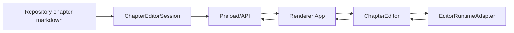

# RFC-0002 Editor Runtime Engine

Version: 1.0 | Status: Accepted for M55 | Date: 2026-07-06

## Summary

M55 defines the Editor Runtime Engine boundary. Novel Studio should move from a textarea-backed chapter editor to a replaceable editor runtime, with CodeMirror 6 as the recommended first production adapter. The migration must preserve existing autosave, recovery, version history, diff preview, keyboard-first commands, and local-first storage.

The accepted direction is adapter-first:

- The UI consumes `ChapterEditorProps` and `ChapterEditorRuntimeProps`.
- A new renderer-only editor runtime adapter owns the concrete editor implementation.
- Application and Repository remain the source of truth for chapter data and saves.
- CodeMirror 6 is introduced behind the adapter only after tests prove parity with the textarea runtime.

## Motivation

M46 added document metrics, large-document mode, gutter caps, diff summary, and shortcut conflict detection. M52 added a visible runtime status strip. The remaining editor gap is a real text editor runtime: cursor/range metadata, selection-aware AI actions, robust Markdown editing, and visual diff review.

The project must not convert the editor into a God Component or let the renderer bypass Application/Repository. This RFC establishes a stable boundary before implementation.

## Decision

Create an Editor Runtime Engine abstraction in the renderer package:

```ts
interface EditorRuntimeAdapter {
  readonly runtimeId: string;
  readonly adapterLabel: string;
  mount(input: EditorRuntimeMountInput): EditorRuntimeHandle;
}

interface EditorRuntimeHandle {
  getSnapshot(): EditorRuntimeSnapshot;
  applyExternalBody(body: string): void;
  focus(): void;
  destroy(): void;
}
```

The adapter emits structured events:

- `body-changed`
- `selection-changed`
- `save-requested`
- `command-dispatched`
- `runtime-warning`

The React component translates these events into existing callbacks like `onBodyChange` and `onSave`. Application-facing contracts remain unchanged unless a future milestone adds selection-aware AI commands.

## Recommended Adapter

CodeMirror 6 remains the recommended production adapter from the M5 editor spike:

- Better fit for long-form Markdown than Monaco.
- Extension model supports selection, decorations, lint, and custom keymaps.
- Smaller and easier to theme for Novel Studio's dark, dense IDE shell.

The textarea runtime remains as fallback and test baseline until CodeMirror parity is proven.

## Runtime Data Model

`ChapterEditorRuntimeProps` is expanded over time, but remains UI-safe:

- adapter label and runtime id
- document mode
- active line/selection range
- autosave state
- shortcut profile
- warnings
- optional selection summary
- optional performance mode

It must not contain project root paths, secrets, full recovery bodies, or filesystem handles.

## Data Flow



The editor adapter is not a storage authority. It holds transient UI state only. Saves continue through Application and Repository.

## Visual Diff Direction

Visual diff is separate from raw editing:

- Diff input is structured from Application or AI workflow props.
- UI renders preview-only diff by default.
- Applying a diff requires explicit user confirmation.
- Future CodeMirror decorations may render inline diff, but never auto-apply generated content.

## Keyboard and Command Integration

The editor runtime must cooperate with the command palette:

- Editor-local keymaps may handle editing commands.
- Workspace global shortcuts must remain conflict-checked.
- Save command must route to existing save callback.
- AI rewrite/refactor commands must require explicit structured selection metadata.

## Performance Requirements

- Large document mode remains bounded.
- Runtime must avoid rendering unbounded line gutters or decorations.
- Selection and metrics updates must be throttled or transaction-bound.
- Tests must include synthetic large document fixtures before CodeMirror becomes default.

## Migration Plan

1. M60: Extract textarea runtime adapter without behavior changes.
2. M61: Add CodeMirror 6 adapter behind feature flag and runtime status.
3. M62: Add selection metadata and focused editor commands.
4. M63: Add visual diff review adapter/decorations.
5. M64: Make CodeMirror default only after E2E parity and performance gates pass.

## Testing Requirements

- Unit tests for adapter event translation.
- Renderer tests for save, edit, focus, and destroy lifecycle.
- Shortcut conflict tests with editor-local keymaps.
- Large document performance smoke.
- E2E covering edit/save/reopen/autosave recovery with the active adapter.
- Regression tests proving AI suggestions remain preview-only until confirmation.

## Non-Goals

- Collaborative editing.
- Rich text storage.
- Binary document format.
- Direct editor writes to project files.
- Unbounded inline AI generation.

## Changelog

- v1.0: Initial accepted Editor Runtime Engine RFC for M55.
