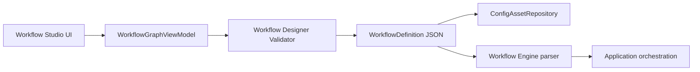

# RFC-0003 Workflow Designer

Version: 1.0 | Status: Accepted for M56 | Date: 2026-07-06

## Summary

M56 defines the Workflow Designer direction. Novel Studio needs a graph-based workflow editing experience for writers and power users, but the designer must not weaken the deterministic Workflow Engine or the structured Agent handoff rule.

The accepted direction is a schema-first graph editor:

- Workflow definitions remain JSON source of truth under `workflow/`.
- The designer edits a structured graph projection of that JSON.
- Validation runs before save.
- Execution remains Application-orchestrated and Workflow Engine-driven.
- Agent, Context, Plugin, and Repository work still happens outside the Workflow Engine.

## Motivation

M45 added branch actions in Workflow Engine. M53 added workflow rail and branch choice visualization. Users still cannot visually inspect or edit multi-step workflows, branch paths, confirmation gates, retry policy, or plugin contributions. A designer is needed, but it must not become an execution engine or string-prompt builder.

## Decision

Add a Workflow Designer as a Studio capability, not as a separate execution layer.

The designer uses three representations:

1. `WorkflowDefinition`: canonical JSON saved in `workflow/`.
2. `WorkflowGraphViewModel`: UI projection with nodes, edges, validation state, and layout.
3. `WorkflowValidationReport`: schema and semantic validation result.

Only `WorkflowDefinition` is persisted. Graph layout may be stored as optional metadata in the workflow asset, never as the only source of truth.

## Node Types

Supported initial node types:

- `context`: build Context Bundle.
- `agent`: call an Agent through Application/Agent Engine.
- `confirmation`: require user approval before mutating actions.
- `branch`: choose one of explicit branch targets.
- `plugin`: call a plugin workflow contribution through Plugin Runtime.
- `save`: persist approved output through Repository.

Unsupported nodes must fail validation with stable errors.

## Data Flow



The designer cannot call models, plugins, or filesystem APIs directly. It only edits and validates definitions through existing Application/Repository paths.

## Validation Rules

Validation runs before save and before execution:

- exactly one start node
- all node ids unique
- all edges point to existing nodes
- no unreachable required nodes unless explicitly disabled
- branch nodes declare at least one branch
- confirmation gates must precede mutating `save` or `plugin asset:write` actions
- plugin nodes require a valid plugin contribution id and `workflow:invoke` permission
- agent nodes reference existing Agent config assets
- prompt references must be ids, not hardcoded prompt text

## Branch and Condition Policy

Conditions are explicit metadata, not arbitrary code. v1 supports:

- manual user branch choice
- Application-provided branch choice from structured Agent output
- deterministic static conditions declared as labels only

Executable condition expression language is deferred. If added later, it requires a separate RFC because expression execution is a sandbox and validation problem.

## Agent Decision Visualization

Agent branch decisions must be stored and displayed as structured JSON:

```json
{
  "stepId": "choose_path",
  "selectedBranchId": "high_tension",
  "reason": "The chapter goal asks for escalation.",
  "confidence": 0.72
}
```

Free-form streamed text may be shown to the user, but it is not the formal branch contract (P9).

## Plugin Workflow Contributions

Plugin workflow steps are available only when all conditions are true:

- plugin enabled
- manifest valid
- app version compatible
- contribution type is `workflow-step`
- required permission grants are present
- input/output schemas validate

Designer UI shows unavailable plugin nodes with structured reasons instead of silently hiding them.

## UX Requirements

- Graph view for nodes and edges.
- Inspector panel for selected node configuration.
- Validation panel with actionable errors.
- Readable JSON preview for power users.
- Keyboard-accessible node selection and command palette actions.
- No marketing or instructional landing page; opening Workflow Studio shows the editable workflow surface.

## Testing Requirements

- Unit tests for graph-to-definition and definition-to-graph conversion.
- Validation tests for invalid edges, duplicate ids, missing branch targets, missing confirmation gates, and unavailable plugin steps.
- UI tests for graph rendering, inspector editing, and validation messages.
- Repository/Application tests proving saves still go through config asset paths and version history.
- E2E covering edit workflow, validation error, successful save, and version restore.

## Non-Goals

- Arbitrary condition code execution.
- Running workflows from the designer without Application orchestration.
- Visual programming language for all app behavior.
- Remote workflow marketplace.
- Replacing JSON source of truth.

## Rollout Plan

1. M65: Add graph projection and validator package tests.
2. M66: Add Workflow Studio graph read-only view.
3. M67: Add node inspector edits and schema validation.
4. M68: Add plugin workflow contribution availability display.
5. M69: Add save/version restore E2E and make graph designer the default workflow editing surface.

## Changelog

- v1.0: Initial accepted Workflow Designer RFC for M56.
