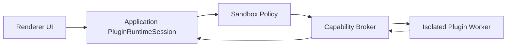

# RFC-0004 Plugin Runtime Sandbox

Version: 1.0 | Status: Accepted for M65 | Date: 2026-07-06

## Summary

M65 defines the policy for future `sandboxed-code` plugin execution. Novel Studio will not run arbitrary third-party plugin code until isolation, signing, permission prompts, timeout teardown, and audit logging are implemented behind explicit adapters.

## Motivation

RFC-0001 allowed manifest-only, host-command, and mock workflow-step plugin slices. The remaining plugin gap is running third-party code. That boundary is high risk because plugins may try to read manuscripts, exfiltrate secrets, call models directly, or escape Electron/Node isolation.

## Decision

The accepted direction is a denied-by-default sandbox runtime:

- Plugin code runs outside the renderer and outside the main Application process authority.
- Filesystem, network, model invocation, shell execution, and project data access are unavailable unless granted by a typed capability.
- The Application layer brokers all project data access through DTOs with least-privilege scopes.
- Runtime sessions are timeout-bound, cancelable, and torn down after each invocation unless a later RFC allows long-lived workers.
- Plugin packages must be signed or locally trusted before `sandboxed-code` can be enabled.

## Runtime Boundary

The sandbox cannot call Repository, LLM Adapter, Workflow Engine, Electron, Node filesystem, shell, or network APIs directly.

## Permissions

Initial permission families:

- `project:summary`: read a redacted project summary DTO.
- `asset:read`: read declared asset scopes.
- `asset:write`: request a host-mediated write with explicit user confirmation.
- `workflow:invoke`: run as a declared workflow step through Application orchestration.
- `network:access`: denied by default and requires explicit endpoint allowlist.
- `model:invoke`: denied by default; future support must route through Application-owned AI workflows.

## Signing and Trust

Plugin packages have one of three trust states:

- `trusted-local`: installed by the user from a local path and explicitly trusted.
- `signed`: package signature and manifest digest verified.
- `untrusted`: may be inspected as manifest-only but cannot execute code.

## Timeout and Teardown

Every sandbox invocation must define:

- timeout milliseconds,
- maximum output payload size,
- cancellation token,
- teardown behavior,
- structured error mapping,
- redacted audit entry.

Timeouts return `PLUGIN_RUNTIME_TIMEOUT`. Invalid outputs return `PLUGIN_RUNTIME_INVALID_OUTPUT`. Sandbox startup or teardown failures return `PLUGIN_RUNTIME_SANDBOX_FAILED`.

## Security Requirements

- Secrets are never injected into plugin environment variables.
- Manuscript content is never available unless a permission and asset scope require it.
- Logs redact project content by default.
- Network access uses explicit endpoint allowlists, not broad internet access.
- Plugin output is schema-validated before Application or Workflow Engine consumption.
- The renderer never hosts plugin code in a webview for v1.

## Testing Requirements

- Policy tests for denied-by-default capability checks.
- Fixture sandbox tests for timeout, cancellation, teardown, invalid output, and payload limits.
- Secret redaction tests.
- Permission prompt tests before any `asset:write`, `network:access`, or `model:invoke` capability ships.
- Package boundary tests proving sandbox code cannot import Repository, Electron, shell, or LLM Adapter modules.

## Non-goals

- Marketplace implementation.
- Remote automatic update.
- Long-lived plugin daemons.
- Plugin UI webviews.
- Direct plugin filesystem, shell, network, or model access.

## Rollout Plan

1. M65: Accept this RFC and keep `sandboxed-code` disabled.
2. M68+: Add sandbox policy DTOs and denied-by-default tests.
3. M69+: Add fixture isolated worker with timeout teardown.
4. Future RFC: Marketplace install/update and signature distribution.

## Changelog

- v1.0: Initial Plugin Runtime Sandbox RFC.
