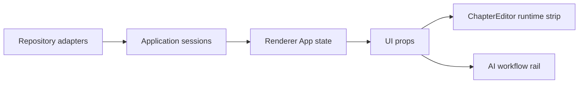

# M52/M53 Editor Runtime and Workflow UX Design

## Status

Version: 1.0 | Status: Approved by direct user instruction | Date: 2026-07-06

## Context

The roadmap after M51 calls for M52 Editor Runtime and M53 Workflow UX. The current desktop app has a reliable local-first chapter editor, autosave recovery, multi-tab state, AI workflow observability, history, retry, streaming, and branch support in the engine. The visible UX still reads as a set of productized slices: the editor is a textarea-backed component without an explicit runtime surface, and workflow steps are mostly rendered as linear text lists.

Per `PROJECT_CONSTITUTION.md` P1, P2, P5, P8, P9, and section 11, this milestone should improve the IDE surface without adding hidden model calls, renderer filesystem access, or hardcoded prompt/model behavior.

## Recommended Approach

Use an incremental productization slice:

- M52 adds an explicit editor runtime DTO and status strip to the UI. It reports the active adapter, document mode, line range, autosave state, shortcut profile, and runtime warnings. This creates a stable seam for a future CodeMirror 6 runtime without forcing a risky editor migration in the same milestone.
- M53 upgrades workflow observability rendering from a plain step list to a workflow rail. The rail supports context, agent, confirmation, and branch steps, including branch choices and selected branch display. The same structure is reusable for live observability and selected run history.

Rejected alternatives:

- Full CodeMirror 6 migration now: higher regression risk around autosave, recovery, selection, E2E, and IME behavior.
- Full workflow designer now: too broad for M53 and overlaps with future Plugin Runtime and Workflow Studio work.

## M52 Design

`ChapterEditorProps` gains optional `runtime`. The runtime is pure UI data:

- `adapterLabel`: current runtime adapter, initially textarea-backed.
- `documentMode`: Markdown for chapters.
- `activeRangeLabel`: current visible/active range label.
- `autosaveLabel`: autosave/recovery status visible to the user.
- `shortcutProfileLabel`: shortcut profile or conflict state.
- `warnings`: bounded user-facing runtime warnings.

The renderer computes this from already available editor props and shell state. It does not read files, watch the filesystem, or persist new source data. The UI renders it as a compact status strip near the editor header.

## M53 Design

`AiWorkflowObservedStepKind` gains `branch`. Each observed step may include:

- `description`
- `branchChoices`
- `selectedBranchId`

The workflow rail renders steps as nodes with status, kind, optional description, and branch choices. Branch choices show selected/unselected state. The rail appears in current observability and selected history detail. The bottom panel continues to show a compact summary.

## Data Flow

No new storage is introduced. No Agent handoff contract changes are introduced. Branch UX consumes structured observability props only.

## Risks

- The editor runtime is still textarea-backed. This is intentional; M52 prepares the UI and DTO boundary before CodeMirror migration.
- Workflow branch UX can only display branch choices when upstream observability provides them. M53 makes the UI ready without inventing branch decisions in the renderer.
- Existing terminal mojibake means tests may assert against existing encoded strings. New tests should prefer ASCII labels such as `Editor Runtime`, `Workflow rail`, and branch ids where possible.

## Acceptance Criteria

- Chapter editor renders an `Editor Runtime` strip with adapter, mode, active range, autosave, shortcut profile, and warnings.
- The runtime strip is optional and does not break existing editor props.
- Workflow observability renders a `Workflow rail` for live runs.
- Workflow history detail renders the same rail for selected runs.
- Branch steps render choices and selected branch state.
- Typecheck, lint, format, unit tests, E2E, and `git diff --check` pass before commit.

## Changelog

- v1.0: Initial M52/M53 design.
