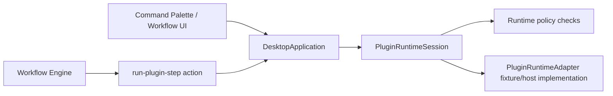

# M57/M58 Plugin Runtime Host Commands and Workflow Adapter Design

Version: 1.0 | Status: Accepted | Date: 2026-07-06

## Goal

M57 introduces the first executable Plugin Runtime slice without allowing arbitrary third-party code execution. M58 adds workflow-step orchestration support while keeping Workflow Engine deterministic and side-effect free.

## Milestone Boundary

- M57: Application-owned `PluginRuntimeSession` lists enabled host-command contributions and executes them only through an injected host adapter.
- M58: Workflow Engine can emit a structured `run-plugin-step` action, and Application can route that action through the same runtime policy and adapter boundary.
- The renderer does not read plugin files, invoke plugin code, or access the filesystem.
- `sandboxed-code`, marketplace, remote installation, plugin network access, and direct LLM access remain deferred.

## RFC Numbering Decision

`RFC-0001` originally labels Command Palette exposure as M58 and workflow-step adapter as M59. The active `ROADMAP.md` and `docs/productization/m54-m56-runtime-rfcs.md` already define M58 as Plugin Workflow Step Adapter. This milestone follows the active roadmap and treats command exposure as part of M57 host-command listing.

## Architecture

## Policy

Runtime execution requires:

- plugin entry is enabled;
- manifest status is valid;
- manifest declares the requested contribution id;
- manifest declares the required capability type;
- manifest and project grants include the required permission and scope.

Command runtime uses `project:read` on `project` scope. Workflow-step runtime uses `workflow:invoke` on `project` scope.

## Data Flow

1. Application receives command listing or execution request.
2. `PluginRuntimeSession` reads a snapshot from `PluginSettingsSession`.
3. Runtime filters valid command contributions and exposes disabled reasons for invalid ones.
4. Execution validates policy again before calling `PluginRuntimeAdapter`.
5. Adapter returns structured JSON output or a unified error.
6. Workflow Engine only returns `run-plugin-step`; Application performs the runtime side effect.

## Pros

- Keeps P8 layering intact: Workflow Engine stays pure, renderer stays filesystem-free.
- Provides visible plugin command contributions without adding sandbox execution risk.
- Fixture-backed adapter makes tests deterministic and CI-safe.

## Cons

- Runtime listing depends on a loaded plugin settings snapshot rather than live background refresh.
- Host-command execution is intentionally narrow and cannot run arbitrary plugin packages.
- Command Palette disabled-state UI can display reasons only after Application provides them.

## Future Extension

- Add sandboxed-code RFC for isolated plugin workers, signing, timeout teardown, and permission prompts.
- Add renderer command metadata for disabled reason styling.
- Add workflow-run history records for plugin-step input/output redaction.
- Add contribution-specific schemas once Plugin Schema Registry exists.

## Risk Analysis

| Risk                                        | Impact                     | Mitigation                                  |
| ------------------------------------------- | -------------------------- | ------------------------------------------- |
| Confusing RFC milestone labels              | Duplicated or skipped work | This design records roadmap precedence      |
| Plugin commands bypass permissions          | Project data exposure      | Policy checks run on listing and execution  |
| Workflow Engine starts executing plugins    | P8 violation               | Engine emits only `run-plugin-step` action  |
| Invalid adapter output leaks into workflows | Unstable workflow state    | Runtime validates output is structured JSON |

## Changelog

- v1.0: Initial M57/M58 design.
