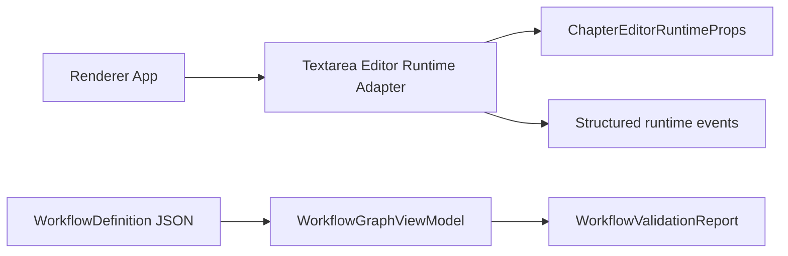

# M59/M60 Editor Runtime Adapter and Workflow Graph Projection Design

Version: 1.0 | Status: Accepted | Date: 2026-07-06

## Goal

M59 extracts the textarea-backed editor runtime into a renderer adapter without changing editing behavior. M60 adds a pure Workflow Graph projection and validator so future Workflow Designer UI can inspect definitions without becoming an execution layer.

## Scope

- M59: add a renderer-only `EditorRuntimeAdapter` abstraction, textarea adapter, runtime handle, structured editor events, and runtime props derivation.
- M60: add `WorkflowGraphViewModel` projection, edge construction, node metadata, and semantic validation report inside Workflow Engine.
- Keep Application/Repository as the only storage authority.
- Keep Workflow Engine deterministic and side-effect free.

## Non-Goals

- No CodeMirror 6 adapter yet.
- No editor selection-aware AI commands yet.
- No inline visual diff decorations.
- No Workflow Designer UI yet.
- No graph layout persistence.
- No executable condition language.

## Architecture

## M59 Data Flow

1. Renderer creates a textarea runtime adapter.
2. The adapter mounts against the current chapter body and save status.
3. Runtime events describe body changes, save requests, selection changes, commands, and warnings.
4. Renderer continues routing body edits and saves through existing callbacks and preload/Application paths.
5. Runtime props are derived from the adapter snapshot and passed to `ChapterEditor`.

## M60 Data Flow

1. `WorkflowDefinition` remains canonical JSON.
2. `buildWorkflowGraphViewModel()` projects steps to nodes and next/branch/default relationships to edges.
3. `validateWorkflowGraph()` checks graph-level semantic issues that are useful before save or designer rendering.
4. Validation returns structured issues; it does not execute agents, plugins, model calls, or filesystem operations.

## Trade-Offs

- Extracting the textarea adapter first is lower risk than introducing CodeMirror and adapter boundaries together.
- Keeping graph projection in Workflow Engine avoids a new package for now, but it must remain pure and dependency-light.
- Validator rules are intentionally conservative and structural; richer Agent/Plugin availability checks require Application context in later milestones.

## Risks

| Risk                                      | Impact               | Mitigation                                                                              |
| ----------------------------------------- | -------------------- | --------------------------------------------------------------------------------------- |
| Adapter duplicates editor component state | Future drift         | Runtime snapshot is read-only UI state; body source of truth stays in React/Application |
| Workflow graph becomes execution logic    | P8 violation         | Graph functions only return DTOs and validation reports                                 |
| Validator over-rejects existing workflows | Product friction     | M60 limits rules to structural graph validity and missing required node metadata        |
| CodeMirror migration hidden in M59        | High regression risk | CodeMirror remains explicitly deferred                                                  |

## Changelog

- v1.0: Initial M59/M60 design.
