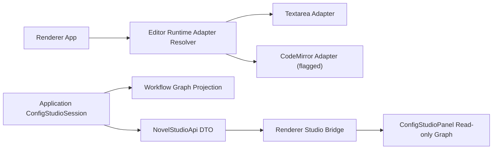

# M61/M62 CodeMirror Flag and Workflow Graph View Design

Version: 1.0 | Status: Accepted | Date: 2026-07-06

## Goal

M61 adds a CodeMirror runtime adapter behind an explicit feature flag while keeping textarea as the default editor runtime. M62 exposes the M60 workflow graph projection as a read-only Workflow Studio surface.

## Scope

- M61 adds adapter selection helpers and a CodeMirror-compatible runtime adapter contract.
- M61 does not enable CodeMirror by default and does not add a real CodeMirror dependency yet.
- M62 attaches workflow graph projection and validation report to workflow config asset snapshots in the Application layer.
- M62 renders graph nodes, edges, and validation issues in `ConfigStudioPanel` when the selected asset is a workflow.

## Architecture

## Decisions

- CodeMirror remains opt-in through a runtime flag. The adapter produces the same structured events and snapshots as textarea.
- The real CodeMirror package is deferred until parity and bundle strategy are decided; M61 creates the adapter boundary and tests.
- Workflow graph projection is generated in Application, not renderer, to avoid frontend-to-engine layer jumps.
- The graph view is read-only. JSON remains the editable and persisted source of truth.

## Risks

| Risk                                             | Impact                    | Mitigation                                                                |
| ------------------------------------------------ | ------------------------- | ------------------------------------------------------------------------- |
| Flagged adapter looks like production CodeMirror | User expectation mismatch | Label adapter as `CodeMirror Adapter (flagged)` and keep default textarea |
| Renderer imports Workflow Engine directly        | P8 violation              | Application attaches graph DTO to config snapshots                        |
| Graph view diverges from JSON                    | Confusion                 | Graph is derived from current asset content only                          |
| Validation appears to block editing              | Friction                  | M62 displays issues but save still uses existing schema path              |

## Changelog

- v1.0: Initial M61/M62 design.
