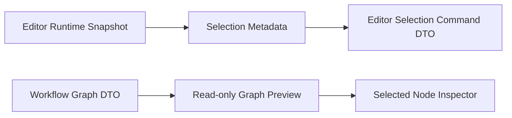

# M63/M64 Editor Selection Metadata and Workflow Inspector Design

Version: 1.0 | Status: Accepted | Date: 2026-07-06

## Goal

M63 adds structured editor selection metadata and command DTOs that future AI actions can consume. M64 adds a read-only Workflow Studio inspector for the selected graph node.

## Scope

- M63 extends editor runtime snapshots with selection summaries: normalized offsets, selected text preview, character count, line range, and collapsed state.
- M63 adds a selection command DTO builder for future focused editor commands.
- M63 does not execute selection-aware AI actions.
- M64 renders an inspector for the workflow entry node by default, including metadata, incoming/outgoing edges, and validation details.
- M64 does not edit graph nodes or persist graph layout.

## Data Flow

## Decisions

- Selection offsets are normalized so reverse selections are stable.
- Selected text is included as a bounded preview in renderer memory only; it is not persisted.
- The first inspector target is the workflow entry node because M62 is read-only and has no graph selection interaction yet.
- Validation issues are shown in the inspector area so users can connect graph structure to actionable errors.

## Non-Goals

- No AI command execution from selection metadata.
- No CodeMirror default migration.
- No inline diff decorations.
- No graph node editing.
- No graph layout persistence.

## Changelog

- v1.0: Initial M63/M64 design.
